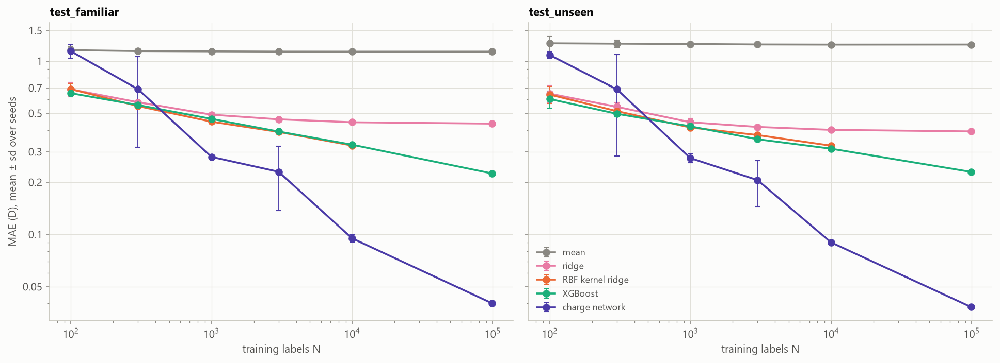
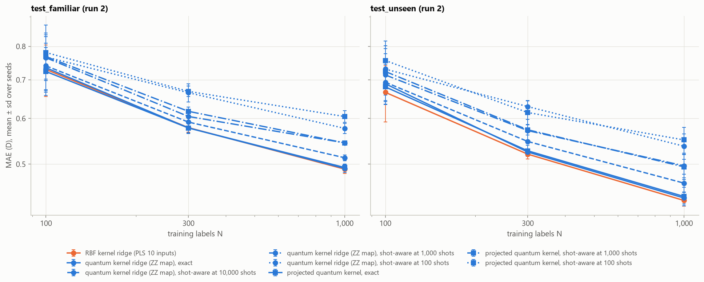
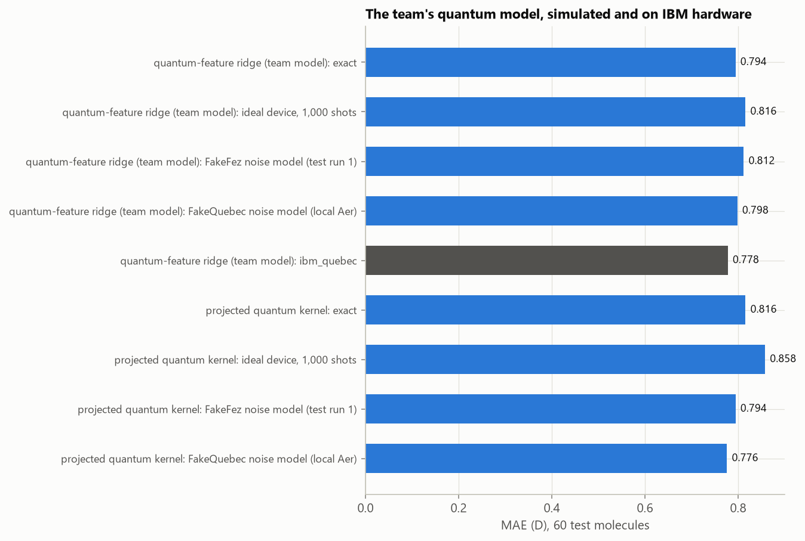

# Learning QM9 dipole moments from fewer labels: quantum kernel regression vs classical models

Qiskit Fall Fest 2026 (University of Ottawa) · Prompt 07/08, QML (Advanced) · team repository

We predict the **dipole-moment magnitude |μ| (debye)** of small organic molecules from their atoms and 3D geometry,
with team-built quantum regression models written in Qiskit. We compare them with classical models as the number of
training labels grows from 100 to 99,198, on molecules whose formulas were seen in training and on formulas never seen.

**Main findings** (test sets; mean absolute error in debye, mean over 3 seeds):

- **The quantum models tie their classical twin.** With 1,000 training labels, quantum kernel ridge regression on 10
  qubits reaches **0.492 D** (familiar formulas) and **0.437 D** (unseen formulas). RBF kernel ridge on the same
  10 inputs reaches 0.490 / 0.433 D. A control with no entanglement does equally well, so the quantum feature map adds
  nothing measurable here.
- **Classical models win as data grows.** A latent-charge neural network reaches **0.040 D** with all 99,198 training
  labels, 28× better than predicting the mean (1.14 D). No quantum model can be trained at that scale on any
  realistic hardware budget.
- **Finite shots break the headline quantum model unless it is tuned for them.** Tuned on exact simulation, it fails
  at 1,000 shots per circuit (≈ 10 D error). Tuned with the shot noise inside cross-validation, it scores 0.544 D
  (a post-hoc change, labeled as such).
- **One quantum model ran on IBM hardware** (`ibm_quebec`, 160 circuits × 1,000 shots, 45 s of QPU time). It matched
  exact simulation within sampling error: 0.778 D vs 0.794 D on 60 test molecules.


*Test-set error vs number of training labels. Blue: quantum models on 10 qubits. Orange: RBF kernel ridge on the same
10 inputs. Dashed black: the best classical model at each size. Dotted gray: predicting the mean. Error bars: standard
deviation over 3 seeds.*

## Contents

1. [Problem and goal](#1-problem-and-goal)
2. [Data and assumptions](#2-data-and-assumptions)
3. [Approach](#3-approach)
4. [Setup and execution](#4-setup-and-execution)
5. [Experiments](#5-experiments)
6. [Results](#6-results)
7. [Discussion and limitations](#7-discussion-and-limitations)
8. [Conclusions](#8-conclusions)
9. [Sources and contributions](#9-sources-and-contributions)

---

## 1. Problem and goal

**Prompt.** *"Learn molecular dipoles from fewer labels. How much reference data does a model need to predict
molecular polarity?"* (Prompt 07/08, QML Advanced; the prompt slide is [docs/prompt_slide.png](docs/prompt_slide.png)). Use a QM9 subset to
predict dipole-moment magnitude, compare a quantum regressor with classical models at several data sizes, and test
familiar and unseen molecular formulas. Show prediction error vs label count, generalization and quantum cost.
The full brief also asks for: mean, RBF and tree baselines; matched compressed and uncompressed inputs; at least
three nested training sizes × three seeds; MAE and RMSE in debye; one representation ablation; finite-shot and noisy
inference; invariance to rotation, translation and atom relabeling; bounded circuit outputs mapped back to debye;
and final test results that do not select settings.

**Motivation.** The dipole moment measures a molecule's charge separation: it drives solubility, intermolecular forces
and spectroscopy. Each reference label in QM9 required a density-functional-theory (DFT) calculation, so a model that
needs fewer labels saves expensive computation. Quantum kernel methods are often proposed for small-data regimes,
which makes this a natural test.

**Questions.**
1. How does prediction error fall as the number of labeled molecules grows, for quantum and classical models?
2. Does a quantum regressor match or beat classical models given the same inputs and data?
3. Do the models generalize to molecular formulas absent from training?
4. What would the quantum models cost to run on real hardware, and do they survive finite shots and noise?

**Scope.**
- **Inputs:** atomic numbers and 3D coordinates (Z, R) only, as the brief asks. QM9's other computed properties (e.g.
  Mulliken charges) were used only in clearly labeled exploration, never in the headline comparison.
- **Data size:** quantum models train on up to 1,000 molecules; classical models on up to 99,198.
- **Hardware:** quantum models run in exact simulation, with simulated shots and noise, plus one run on IBM hardware.

**Success metric.**
- **Primary:** mean absolute error (MAE) in debye on held-out test sets, at nested training sizes × 3 seeds. RMSE is
  reported too.
- **Generalization:** familiar vs unseen formulas.
- **Fairness:** every quantum model is paired with a classical "twin" that has the same inputs, data, cross-validation
  folds and tuning budget.
- **Cost:** circuits and QPU time.

Beating classical ML was not required: a fair comparison and an honest conclusion were.

## 2. Data and assumptions

**Source.** QM9 (Ramakrishnan et al. 2014): 133,885 molecules with up to nine heavy atoms (C, N, O, F). Geometries and
properties were computed with DFT at the B3LYP/6-31G(2df,p) level; they are reference calculations, not measurements.
The molecules come from the GDB-17 enumeration (Ruddigkeit et al. 2012).
- **Version:** figshare collection 978904 ("Quantum chemistry structures and properties of 134 kilo molecules"),
  downloaded 2026-10-04.
- **Getting the data:** it is not redistributed here. [notebooks/00_setup_and_data.ipynb](notebooks/00_setup_and_data.ipynb)
  downloads the three files (86 MB) into `data/raw/` and verifies them against figshare's published MD5 checksums. To
  download by hand, fetch figshare files 3195389 (`dsgdb9nsd.xyz.tar.bz2`), 3195404 (`uncharacterized.txt`) and
  3195392 (`readme.txt`) into `data/raw/`; their sizes and MD5 checksums are in `src/qm9dipole/data.py`.
- **Units:** μ in debye (D); coordinates in ångström (Å).

**Preprocessing** ([notebooks/01_parse_and_splits.ipynb](notebooks/01_parse_and_splits.ipynb)). The archive is read in place and parsed into one table with every field kept (0 parse
failures). 3,202 molecules are excluded, leaving **130,683**:

| Excluded | Count | Reason |
|---|---|---|
| Listed in QM9's `uncharacterized.txt` | 3,054 | The optimized geometry no longer matches the intended molecule |
| Flagged in QM9's readme as hard to converge | 8 | Saddle points or low convergence thresholds |
| Duplicate entries | 140 | Same molecule listed twice; keeps one copy, so no molecule can sit in two sets |

**Splits** ([src/qm9dipole/splits.py](src/qm9dipole/splits.py), [configs/splits.yaml](configs/splits.yaml), split seed
2026; saved as QM9 molecule IDs in [splits/](splits/)):

| Set | Molecules | Formulas | Role |
|---|---|---|---|
| Training pool | 99,198 | 497 | Training sets are drawn from it |
| `dev` (development, familiar formulas) | 5,000 | 257 | Model development, before any test run |
| `dev_unseen` (development, held-out formulas) | 4,183 | 26 | Development check on unseen formulas |
| **`test_familiar`** | 5,484 | 257 | Test: formulas present in training |
| **`test_unseen`** | 16,818 | 93 | Test: whole formulas absent from all training and development data |
| `test_familiar_q`, `test_unseen_q` | 80, 370 | 20, 93 | Small test subsets for the costly quantum shots/noise/hardware runs |

- **Nested training sets:** S_(s,N) for N = 100 ⊂ 300 ⊂ 1,000 ⊂ 3,000 ⊂ 10,000 ⊂ 30,000 ⊂ 99,198 and seeds
  s = 0, 1, 2, identical for every model, so comparisons are paired.
- **Anchors:** the 20 formulas of the familiar quantum subset are "anchored", so every training set contains them.
- **Checks:** every split invariant (disjointness, nesting, held-out formulas absent from training) is asserted when
  the splits are built and tested in [tests/test_splits.py](tests/test_splits.py), each test paired with a negative
  control.

**Inputs (features).** Every feature is a function of Z and R alone
([src/qm9dipole/descriptors.py](src/qm9dipole/descriptors.py), [features.py](src/qm9dipole/features.py),
[atoms.py](src/qm9dipole/atoms.py)). There are 188 molecule-level features:
- composition (5 element counts);
- engineered geometry, bond and ring features (26);
- functional groups (19);
- a charge-equilibration (QEq) dipole estimate (3);
- radial distribution functions (106);
- the sorted Coulomb-matrix eigenvalues (29).

The latent-charge network instead uses 85 per-atom environment features. All features are invariant to rotation,
translation and atom reordering; tests check this, with a raw-coordinate negative control that must fail
([notebooks/02_descriptors_invariance.ipynb](notebooks/02_descriptors_invariance.ipynb)).

**Assumptions.**
1. The DFT-optimized geometry is an available input. In practice it costs a quantum-chemistry geometry optimization;
   the brief treats it as given.
2. |μ| is invariant to rotation, translation and atom relabeling, so the models must be too.
3. Every fitted transform (scaling, PLS, target transform, kernel bandwidths) is fit on the current training set only
   and refit for every (size, seed).
4. Labels are the QM9 reference values as published. Rare zwitterions with |μ| up to 29.6 D are kept: they are valid
   values, but they weigh heavily on RMSE.

## 3. Approach

**Pipeline of the quantum models** (Track B; every learned step is fit on training data only):

```
Z, R  →  188 invariant features  →  Yeo-Johnson scaling (clipped at ±10)  →  PLS to 10 components  →  angles γ·x
      →  10-qubit Qiskit encoding circuit U(x)  →  one of three quantum readouts
             ├─ fidelity kernel   k(x,x′) = |⟨ψ(x)|ψ(x′)⟩|²   (one circuit per pair of molecules)
             ├─ projected kernel  RBF on each qubit's Bloch vector ⟨X⟩,⟨Y⟩,⟨Z⟩   (3 circuits per molecule)
             └─ ⟨Z⟩ features       one expectation per qubit   (1 circuit per molecule)
      →  kernel ridge / ridge regression on √|μ|  →  |μ| in debye
```

**Quantum models** ([src/qm9dipole/models/quantum_kernel.py](src/qm9dipole/models/quantum_kernel.py),
[models/quantum.py](src/qm9dipole/models/quantum.py)). All are built on the team's encoder,
`build_encoding_circuit`:

| Model | Encoding (10 inputs) | What a device measures | Role |
|---|---|---|---|
| **Quantum kernel ridge (QKRR), ZZ map** | Qiskit `zz_feature_map`, linear entanglement, 2 passes, 10 qubits | all-zeros probability of U(x′) followed by U(x)† | **headline quantum model** (chosen by CV) |
| QKRR, RY + CZ | RY angle per qubit, CZ ladder, 2 passes | same | encoder variant |
| QKRR, RY-RZ | two angles per qubit, 5 qubits | same | encoder variant |
| Product-state kernel | RY, 1 pass, no entangling gates (a classical kernel in quantum form) | same | control: is entanglement needed? |
| Projected quantum kernel | ZZ map | ⟨X⟩, ⟨Y⟩, ⟨Z⟩ of every qubit | after Huang et al. (2021) |
| Quantum-feature ⟨Z⟩ ridge (team model) | ZZ map | ⟨Z⟩ of every qubit, then ridge regression | the team's original model; also run on hardware |

The angle scale γ and the ridge penalty α are tuned by 5-fold cross-validation inside each training set. The team model
has no trainable gates: a fixed encoding circuit, one ⟨Z⟩ per qubit, and a ridge readout fit on those values
([src/qm9dipole/models/quantum.py](src/qm9dipole/models/quantum.py)).

**What Qiskit does here.**
- **Circuits:** every circuit is a Qiskit `QuantumCircuit` (`zz_feature_map` and library gates).
- **Exact simulation:** statevectors of all molecules are computed together by a batched simulator that reads the
  Qiskit circuit ([models/qsim.py](src/qm9dipole/models/qsim.py)). It matches `qiskit.quantum_info.Statevector` to
  1e-12 and makes a 10-qubit kernel on 1,000 molecules take seconds.
- **Finite shots:** drawn exactly as an ideal device returns them. This shot model is validated against Qiskit Aer's
  `SamplerV2` (z-scores: mean −0.01, sd 1.00).
- **Hardware noise:** Aer `SamplerV2` with noise models from `qiskit-ibm-runtime`'s fake backends (FakeFez; FakeQuebec,
  IBM's fake backend for `ibm_quebec`) after transpiling for the device
  ([src/qm9dipole/noise.py](src/qm9dipole/noise.py)).
- **Cost:** transpilation with Qiskit's preset pass manager, plus gate counts and durations
  ([src/qm9dipole/cost.py](src/qm9dipole/cost.py)).
- **Hardware:** the run uses `qiskit-ibm-runtime`'s `SamplerV2` on `ibm_quebec`
  ([src/qm9dipole/hardware.py](src/qm9dipole/hardware.py)).

**Classical components and baselines** ([src/qm9dipole/models/](src/qm9dipole/models/)). The brief's baselines (mean,
RBF and tree models) and more, in two tracks:
- **Track B, quantum-comparable** (N ≤ 1,000, same preprocessing as the quantum models): mean predictor, ridge, RBF
  kernel ridge and random forest. Each runs on the same 10 PLS inputs and on all 188 features; RBF kernel ridge,
  random forest and two quantum kernels also run on composition only (the ablation).
- **Track A, most accurate classical** (any size up to 99,198, its own preprocessing): ridge, RBF kernel ridge
  (N ≤ 10,000), XGBoost, and a **latent-charge network**
  ([models/charge.py](src/qm9dipole/models/charge.py)). That network predicts a charge and a small dipole for every
  atom from its environment (three rounds of message passing over bonds) and returns |Σ qᵢ rᵢ + atomic dipoles|.
  The dipole is built the way physics builds it, so the model is invariant by construction.

**Fair-comparison protocol** (decided before any quantum result was computed).
- **Same everything:** quantum and classical kernel models share the inputs, training sets, folds, CV metric (pooled
  MAE in debye), refit and grid size (88 candidates each).
- **Same tuning code:** the quantum tuning code reproduces the classical one exactly when given the RBF kernel (unit
  test), so a quantum-vs-RBF difference comes from the kernel, not from the tuning.
- **Headline chosen by CV:** the headline quantum model was chosen by CV MAE at N = 1,000, inside the training data.
- **Track A references:** the best Track A model at each size was chosen on the development set.

**Why these choices.**
- **Kernel methods:** kernel ridge has a closed-form, convex fit, so there is no variational circuit training (and
  no barren plateaus). It also allows a clean one-to-one comparison with RBF kernel ridge.
- **PLS to 10 inputs:** the qubit budget needs a compression. PLS beat PCA and mutual-information selection, for
  quantum and classical alike.
- **Two tracks:** "the best classical model" and "the classical model a quantum model can be compared with fairly"
  are different questions, so both are reported.
- **Feature-based quantum models for hardware:** they need 1–3 circuits per molecule instead of one per pair, which
  makes them the only ones that fit a QPU budget.

## 4. Setup and execution

**Requirements.** Python **3.12**. Exact pins are in [requirements.txt](requirements.txt), compatible ranges in
[pyproject.toml](pyproject.toml). The main packages: qiskit 2.5.2, qiskit-aer 0.17.2, qiskit-ibm-runtime 0.50.0,
numpy 2.5.3, scipy 1.18.1, scikit-learn 1.9.1, pandas 3.0.6, xgboost 3.4.1, pytest 9.1.1. An ordinary CPU is enough;
every runtime below is for an 8-core laptop.

**Install** (from the repository root):

```bash
# Option A: conda
conda env create -f environment.yml
conda activate qm9dipole
pip install -r requirements.txt        # after activation; also installs this package (editable)

# Option B: plain Python 3.12
python3.12 -m venv .venv               # Windows: py -3.12 -m venv .venv
source .venv/bin/activate              # Windows: .venv\Scripts\activate
pip install -r requirements.txt

pip check && pytest -q                 # all tests pass (data-dependent ones skip until QM9 is downloaded)
```

<details><summary>Troubleshooting and notebook kernels</summary>

- **`No matching distribution found for numpy==2.5.3`:** the environment is not Python 3.12. Recreate it with 3.12.
- **Windows, `OSError` with a very long path during `pip install`:** the path exceeds Windows' 260-character limit.
  Clone into a shorter folder, or enable long paths (`LongPathsEnabled`).
- **The first notebook cell says the package belongs to another checkout:** the selected kernel belongs to a
  different copy of the project; select this copy's environment.
- **Kernels:** the notebooks use the standard `python3` kernel. In VS Code, pick the `qm9dipole` (conda) or `.venv`
  environment in the kernel picker. In JupyterLab, start `jupyter lab` from the activated environment.
- **Environment check:** the first cell of every notebook checks the environment and warns about version differences.
</details>

### Reproduce the main result (≈ 45 minutes)

This retrains every model of the headline quantum-vs-classical comparison (test run 1, quantum section: 22 models ×
3 sizes × 3 seeds) and scores the test sets:

```bash
jupyter nbconvert --to notebook --execute --inplace notebooks/00_setup_and_data.ipynb                 # QM9 download, ~1 min
jupyter nbconvert --to notebook --execute --inplace notebooks/01_parse_and_splits.ipynb               # parse + splits, ~1 min
jupyter nbconvert --to notebook --execute --inplace notebooks/explore_02_cleaning_and_features.ipynb  # features, ~2 min
python scripts/final_eval.py --config configs/test_eval_run1.yaml --sections quantum --allow-dirty    # ~40 min
```

- **What the last command writes:** `results/comparison/test_runNN_quantum.csv` (next free run number) and a new row in
  `results/test_runs.csv`.
- **Why `--allow-dirty`:** the script normally refuses to run with uncommitted changes, and executing the notebooks
  above modifies them.
- **No re-tuning:** the scaling, PLS size and model grids come from committed results of the exploration notebooks.

To compare with the committed run 1 (the difference is 0.0 on the same platform):

```python
import glob, pandas as pd
new = sorted(glob.glob("results/comparison/test_run*_quantum.csv"))[-1]
key = ["model", "inputs", "seed", "n_train", "eval_set"]
a, b = (pd.read_csv(f).fillna({"inputs": "—"}).set_index(key)["mae_D"] for f in (new, "results/comparison/test_run01_quantum.csv"))
print(new, "max |Δ MAE| =", (a - b.loc[a.index]).abs().max())
```

A faster check: `python scripts/final_eval.py --dry-run --smoke` runs the whole pipeline (one seed, N = 100, all four
sections) on the development sets in about 10 minutes.

### Full pipeline, in order

| Step | What it does | Time |
|---|---|---|
| [00_setup_and_data](notebooks/00_setup_and_data.ipynb) | Download QM9, verify checksums | ~1 min |
| [01_parse_and_splits](notebooks/01_parse_and_splits.ipynb) | Parse, exclusions, splits (reproduces `splits/*.json` exactly) | ~1 min |
| [02_descriptors_invariance](notebooks/02_descriptors_invariance.ipynb) | Descriptors; rotation, translation and relabeling tests with a negative control | ~10 s |
| [explore_01_eda](notebooks/explore_01_eda.ipynb) | Exploratory analysis of every QM9 field | ~30 s |
| [explore_02_cleaning_and_features](notebooks/explore_02_cleaning_and_features.ipynb) | Cleaning; 188 molecule features, 85 per-atom features | ~2 min |
| [explore_03_standardization_and_dimension](notebooks/explore_03_standardization_and_dimension.ipynb) | Scaling and target transform per track; PLS to 10 inputs | ~1.5 h |
| [explore_04_classical_models](notebooks/explore_04_classical_models.ipynb) | Track A to 99,198 labels; Track B baselines | ~9 h |
| [explore_05_generalization_and_diagnostics](notebooks/explore_05_generalization_and_diagnostics.ipynb) | New formulas, errors, feature importance, invariance | ~30 min |
| [explore_06_quantum_vs_classical](notebooks/explore_06_quantum_vs_classical.ipynb) | Quantum models vs matched classical; qubit count, inputs, kernel diagnostics | ~1.5 h |
| [explore_07_shots_noise_cost](notebooks/explore_07_shots_noise_cost.ipynb) | Quantum cost, finite shots, simulated noise | ~50 min |
| `scripts/final_eval.py` (test runs 1, 2) | Retrain everything; score the test sets; shots and noise on the quantum test subsets | run 1 ≈ 4 h 10 min; run 2 ≈ 30 min |
| `scripts/hardware_run.py` (test runs 3, 4) | The ⟨Z⟩ ridge's circuits on a noise model (local) or on IBM hardware | ~2 min local; 45 s QPU |
| [07_test_comparison](notebooks/07_test_comparison.ipynb) | Presents every test run: tables, figures, summary | ~3 min |

- **Development data only:** the exploration notebooks never read a test set.
- **Run them in order:** each reads the previous one's output.
- **Caching:** long notebooks cache finished fits per commit in `data/processed/cache/`, so an interrupted run resumes.
- **Headless:** `jupyter nbconvert --to notebook --execute --inplace --ExecutePreprocessor.timeout=-1 notebooks/<name>.ipynb`.

```bash
python scripts/final_eval.py --config configs/test_eval_run1.yaml        # test run 1 (all sections, ≈ 4 h)
python scripts/final_eval.py                                              # test run 2 (configs/test_eval.yaml, ≈ 30 min)
python scripts/hardware_run.py                                            # test run 3: hardware circuits on the FakeQuebec noise model
python scripts/hardware_run.py --backend ibm_quebec --parts qridge --submit --max-seconds 120   # test run 4 (needs an IBM account; asks to confirm)
python scripts/hardware_run.py --retrieve <job id>                        # fetch and score a submitted job
```

- **IBM account:** read from your local Qiskit configuration (`QiskitRuntimeService(name="pinq2")`, saved once with
  `QiskitRuntimeService.save_account(...)`). No token is stored in the repository.
- **Planning only:** without `--submit`, the hardware script only prints the plan: circuits, shots and estimated QPU
  time.

**Seeds.**
- **Splits:** `split_seed` 2026.
- **Training sets:** seeds 0, 1, 2. Each fixes the training-set fill order, the 5-fold CV folds, the XGBoost search
  and the network initialization.
- **Simulated shots:** each draw is seeded deterministically: by (seed, N, shots, repetition) in the shots section;
  by seed and inputs for the shot-aware kernels.
- **Fixed seeds elsewhere:** Aer sampler seeds are fixed, transpilation uses `seed_transpiler=0`, and the hardware run's
  test molecules are drawn with seed (2027, subset).

**Simulator and backend settings.**
- **Exact:** batched statevectors, float64.
- **Shots:** Binomial(S, p)/S per kernel entry or Pauli expectation, with S ∈ {100, 1,000, 10,000} and 5 repetitions.
- **Noise:** Aer with `NoiseModel.from_backend` (FakeFez; FakeQuebec), density-matrix method, 1,000 shots, circuits
  transpiled with `generate_preset_pass_manager(optimization_level=2)`.
- **Hardware:** `ibm_quebec` via `qiskit-ibm-runtime` `SamplerV2` in job mode, 1,000 shots, default options (no error
  suppression or mitigation), capped by `max_execution_time`.

## 5. Experiments

**What we ran** (settings were fixed before the results they affect; the one exception, test run 2, is labeled
post-hoc):

| Experiment | Where | Settings and budget | Status |
|---|---|---|---|
| Classical analysis X1 (25 molecules per formula, as first planned) | `explore_01–05` (first version) | 8,438 molecules | Done; superseded: the per-formula cap discarded 94% of the data |
| Classical rebuild X2: Track A and Track B learning curves | `explore_01–05` | 7 sizes to 99,198 × 3 seeds (Track A); 3 sizes × 3 seeds × 3 input sets (Track B) | Done |
| Quantum vs classical, development sets | `explore_06` | 6 quantum models, matched grids; qubit count k = 4–16; PCA, top-k and PLS inputs; QKRR to N = 10,000 (1 seed) | Done |
| Cost, shots, noise, development sets | `explore_07` | Transpiled for IBM Heron; shot model validated on Aer; FakeFez noise on 30 molecules | Done |
| **Test run 1**: the development settings, unchanged | `final_eval.py` | 22 quantum-section models; Track A to 99,198; shots (S × 5 reps); FakeFez noise on 60 test molecules | Done |
| **Test run 2** (post-hoc): shot-aware quantum kernels | `final_eval.py` | QKRR at S = 100 / 1,000 / 10,000 and projected kernel at S = 100 / 1,000, tuned with shots inside CV; α grid extended to 1,000 | Done |
| **Test run 3**: hardware circuits on the FakeQuebec noise model | `hardware_run.py` | Projected kernel, ⟨Z⟩ ridge, 10 × 5 fidelity-kernel block; 700 circuits × 1,000 shots 
| **Test run 4**: the ⟨Z⟩ ridge on IBM `ibm_quebec` | `hardware_run.py` | 160 circuits × 1,000 shots (100 training + 60 test molecules), job `db3da0kvf2bc73csuk60` | Done |

**Controlled comparisons.**
- **Classical twin:** each quantum kernel vs RBF kernel ridge on identical inputs, data, folds and budget, paired per
  seed.
- **Entanglement control:** a product-state kernel with no entangling gates.
- **Encoders:** three encoders, plus a qubit-count axis (k = 4–16 inputs).
- **Representation ablation (the brief's):** composition only vs composition + geometry.
- **Exact vs realistic:** exact vs shots vs simulated noise vs hardware, on identical molecules.
- **Reproduction checks:** test run 1 reproduces all 464 development-set rows of notebooks 04 and 06 exactly, and run 2
  reproduces the 180 rows it shares with run 1 exactly.

**What did not work** (and shaped the conclusions):
- **Entanglement and encoder choice made no difference:** all quantum kernels are within 0.013 D of RBF kernel ridge
  at every N and every qubit count.
- **Fidelity kernel and noise:** at larger angle scales the fidelity kernel concentrates exponentially, with
  off-diagonal entries ≈ 0 at 16 qubits. CV therefore picks the smallest angle scale, the regime where it is
  classical-like and where finite shots overwhelm it (≈ 10 D at 1,000 shots before the shot-aware fix).
- **The team's ⟨Z⟩ ridge is weaker than plain ridge** on the same inputs (0.545 vs 0.509 D on `test_familiar` at
  N = 1,000). Its features also have a closed classical form, which we verified to 3e-14.
- **Composition alone is barely better than the mean** (≈ 0.94 D at N = 1,000), for every model.
- **The latent-charge network is unstable below N ≈ 1,000:** one seed scored 1.12 D at N = 300.
- **Early bug:** a first run of the classical notebook produced ridge predictions of 10⁵ D, from scaled values
  extrapolating wildly on unseen molecules. Fixed by clipping scaled inputs at ±10 before any reported result.

**Completed vs proposed.** Everything in the table above is completed. Proposed but **not done**:
- the projected kernel and the fidelity-kernel block on real hardware (implemented in `hardware_run.py`, not
  submitted);
- error mitigation on hardware (twirling, ZNE);
- quantum kernels on learned per-atom features;
- more seeds for the full-pool classical result.

## 6. Results

All numbers are test-set MAE in debye (mean ± sd over 3 seeds), from test run 1 unless marked. Complete tables, RMSE,
R² and figures are in [notebooks/07_test_comparison.ipynb](notebooks/07_test_comparison.ipynb).

**Quantum vs classical at the quantum-comparable sizes** (10 inputs = 10 qubits for the ZZ map):

| Model | N = 100 | N = 300 | N = 1,000 | N = 1,000, unseen formulas |
|---|---|---|---|---|
| **QKRR, ZZ map (headline quantum)** | 0.735 ± 0.062 | 0.578 ± 0.011 | **0.492 ± 0.008** | **0.437 ± 0.010** |
| QKRR, RY + CZ | 0.739 ± 0.068 | 0.585 ± 0.012 | 0.493 ± 0.009 | 0.433 ± 0.007 |
| QKRR, RY-RZ (5 qubits) | 0.708 ± 0.056 | 0.586 ± 0.002 | 0.499 ± 0.006 | 0.441 ± 0.013 |
| Product-state kernel (no entanglement; control) | 0.732 ± 0.075 | 0.578 ± 0.011 | 0.490 ± 0.009 | 0.433 ± 0.009 |
| Projected quantum kernel | 0.724 ± 0.057 | 0.578 ± 0.013 | 0.493 ± 0.007 | 0.440 ± 0.016 |
| ⟨Z⟩ ridge (team model) | 0.731 ± 0.072 | 0.597 ± 0.010 | 0.545 ± 0.011 | 0.493 ± 0.021 |
| **RBF kernel ridge, same 10 inputs (classical twin)** | 0.730 ± 0.075 | 0.578 ± 0.010 | **0.490 ± 0.009** | **0.433 ± 0.010** |
| RBF kernel ridge, all 188 features (best by CV) | 0.662 ± 0.040 | 0.549 ± 0.012 | 0.453 ± 0.009 | 0.420 ± 0.015 |
| Random forest, all 188 features | 0.669 ± 0.025 | 0.580 ± 0.008 | 0.489 ± 0.001 | 0.412 ± 0.003 |
| Mean predictor | 1.156 | 1.142 | 1.138 | 1.254 |

- **Paired difference, quantum − twin, on `test_familiar`:** +0.005 ± 0.013 D at N = 100, −0.001 ± 0.003 D at N = 300
  and +0.001 ± 0.001 D at N = 1,000. On `test_unseen` at N = 1,000: +0.004 ± 0.001 D.
- **RMSE at N = 1,000:** 0.722 D (QKRR) vs 0.720 D (twin) vs 1.457 D (mean).

**The most accurate classical models** (Track A; best model at each N chosen on the development set):

| Training labels N | 100 | 300 | 1,000 | 3,000 | 10,000 | 99,198 (1 seed) |
|---|---|---|---|---|---|---|
| Best model | XGBoost | RBF kernel ridge | charge network | charge network | charge network | charge network |
| `test_familiar` MAE | 0.653 | 0.550 | 0.280 | 0.230 | 0.095 | **0.040** |
| `test_unseen` MAE | 0.604 | 0.514 | 0.276 | 0.206 | 0.090 | **0.038** |
| XGBoost, for comparison | 0.653 / 0.604 | 0.558 / 0.497 | 0.464 / 0.420 | 0.392 / 0.354 | 0.329 / 0.312 | 0.225 / 0.230 |



**Familiar vs unseen formulas.**
- **On the test sets, unseen formulas were not harder:** the unseen/familiar MAE ratio is 0.88–0.98 for every model.
- **On the development sets they were much harder:** QKRR scored 0.734 D on `dev_unseen` vs 0.499 D on `dev`.
- **Interpretation:** how hard unseen formulas are depends strongly on which formulas are held out (93 test formulas,
  26 development formulas).

**Representation ablation.** With composition only (5 element counts), every model scores ≈ 0.94 D (familiar) and
≈ 0.81 D (unseen) at N = 1,000, against 0.49 / 0.44 D with geometry. Geometry carries most of the signal.

**Finite shots** (quantum test subsets, 80 + 370 molecules, N = 1,000; MAE `test_familiar_q` / `test_unseen_q`):

| Model and tuning | Exact | 100 shots | 1,000 shots | 10,000 shots |
|---|---|---|---|---|
| QKRR, tuned on exact kernels (run 1) | 0.623 / 0.704 | 64.4 / 77.5 | 10.5 / 10.7 | 2.16 / 2.59 |
| **QKRR, shot-aware (run 2, post-hoc)** | | 0.703 / 0.781 | **0.665 / 0.701** | 0.622 / 0.684 |
| Projected kernel, tuned on exact (run 1) | 0.613 / 0.742 | 0.827 / 0.925 | 0.658 / 0.761 | 0.628 / 0.750 |
| Projected kernel, shot-aware (run 2) | | 0.728 / 0.812 | 0.658 / 0.693 | |
| ⟨Z⟩ ridge, tuned on exact (run 1) | 0.625 / 0.749 | 0.779 / 0.869 | 0.640 / 0.770 | 0.624 / 0.749 |

On the full test sets the shot-aware QKRR scores 0.544 / 0.497 D at 1,000 shots and 0.513 / 0.464 D at 10,000 (exact:
0.492 / 0.437).



**Noise and real hardware** (60 test molecules, 30 per subset; trained on S_(0,100); 1,000 shots; MAE in D):

| Model | Exact | Ideal device | FakeFez noise | FakeQuebec noise | **IBM `ibm_quebec`** |
|---|---|---|---|---|---|
| ⟨Z⟩ ridge (team model) | 0.794 | 0.816 | 0.812 | 0.798 | **0.778** |
| Projected kernel | 0.816 | 0.858 | 0.794 | 0.776 | — |
| QKRR (fidelity kernel) | 0.833 | 0.833 | 0.919 (0.854 corrected) | — | — |

- **Uncertainty:** with 60 molecules each MAE is uncertain by about ±0.1 D, so the hardware result means "as good as
  simulation", not "better".
- **Fidelity-kernel entries on the FakeQuebec noise model:** mean error 0.31 raw and 0.034 after a
  one-circuit-per-molecule depolarizing correction.
- **Hardware job:** `db3da0kvf2bc73csuk60`, 45 s of QPU charged. IBM's record of the job (timestamps, usage, execution
  span) and the raw shot outcomes are in [results/hardware/](results/hardware/).



**Quantum resource cost** (10 qubits; transpiled for IBM Heron; QPU time ≈ circuits × shots × (circuit duration +
readout + 250 µs repetition delay), a lower bound):

| | Fidelity kernel (QKRR) | Projected kernel | ⟨Z⟩ ridge |
|---|---|---|---|
| Circuit | U(x′) then U(x)†: depth 206, 70 CZ | U(x) + X/Y/Z measurement: depth 109, 36 CZ | U(x) + Z measurement: depth 109, 36 CZ |
| Circuits to train at N = 1,000 | 499,500 (one per pair) | 3,000 | 1,000 |
| Circuits to predict the 22,302 test molecules | 22.3 million | 66,906 | 22,302 |
| QPU time, train + predict at 1,000 shots | ≈ 1,640 h | ≈ 5.0 h | ≈ 1.7 h |

- **Budget:** IBM's Open Plan provides 10 minutes per 28 days.
- **Classical cost:** the charge network trains on all 99,198 molecules in ≈ 35 min on a laptop CPU.
- **Simulation cost:** exact simulation of the 10-qubit models takes seconds per fit.

**Supporting outputs.**
Results and figures are grouped by question; each folder's index is [results/README.md](results/README.md):
- **[results/comparison/](results/comparison/), [figures/comparison/](figures/comparison/):** quantum models vs
  classical models of the same size: test runs 1–2 (`test_run0*_quantum.csv`, `test_run01_headline.csv`,
  `test_run02_shot_aware.csv`) and the development-set study (`explore06_*`, Track B baselines `explore04_track_b`).
- **[results/hardware/](results/hardware/), [figures/hardware/](figures/hardware/):** shots, simulated noise, cost
  and the IBM hardware runs (including IBM's job record and the raw shot outcomes).
- **[results/classical/](results/classical/), [figures/classical/](figures/classical/):** the most accurate classical
  models (Track A) and their diagnostics.
- **[results/development/](results/development/), [figures/development/](figures/development/):** data analysis,
  features and preprocessing choices.
- **Run log:** [results/test_runs.csv](results/test_runs.csv), one row per test run. Every CSV has a `.meta.json` file
  recording the commit, configuration and package versions.

## 7. Discussion and limitations

**What worked.**
- **A fair comparison:** the quantum and classical pipelines share code, data and tuning, which verification shows
  exactly.
- **A physics-shaped classical model:** it reaches 0.040 D.
- **Shot-aware tuning:** it turns an unusable quantum model on a device into a usable one.
- **End-to-end hardware run:** the full pipeline ran on IBM hardware at the predicted cost (41 s estimated, 45 s
  charged).

**What did not.** No quantum advantage. With 10 inputs, the quantum kernels behave like a smooth classical kernel:
- CV chooses small angles, where the fidelity kernel ≈ a wide RBF kernel; the two have the same effective number of
  parameters (71.4 vs 71.7).
- At large angles the kernel concentrates and stops being informative.
- Entanglement made no measurable difference.

**Sources of error and caveats.**
1. **Labels are DFT values, not experiments**, and the models need a DFT-optimized geometry as input.
2. **Rare zwitterions** (|μ| ≥ 9 D, 0.2% of molecules) dominate RMSE.
3. **The full-pool classical result has one seed.** At N = 10,000 the three seeds spanned 0.091–0.100 D.
4. **Test run 2 was designed after seeing run 1.** The shot problem had first appeared on development data, every
   setting was still chosen by CV inside the training data, and run 1's numbers are reported unchanged. Its result
   should still be read as post-hoc.
5. **The hardware run is a feasibility demonstration:**
   - one model, 60 test molecules, 100 training molecules, one calibration day;
   - the projected kernel and the fidelity kernel ran only on simulated noise.
6. **Cost figures are lower bounds:** they include the repetition delay but no job or queue overhead. The hardware job
   waited about 85 min in IBM's queue.

**How far the findings generalize.**
- **Chemistry:** small neutral organic molecules (≤ 9 heavy atoms; C, H, N, O, F) at one level of DFT theory.
- **Quantum models:** fixed (non-trained) encodings with 4–16 qubits and kernel or linear readouts. Trainable feature
  maps, other encodings or much larger qubit counts could behave differently.
- **Comparison method:** the conclusion that the quantum kernel matches its classical twin is specific to these
  models. The method (matched twins, paired seeds, a product-state control) transfers to any quantum kernel study.

## 8. Conclusions

**How much reference data does a model need to predict molecular polarity?**
- **About 1,000 labels for ≈ 0.5 D:** any model on our 10-input representation reaches ≈ 0.5 D MAE (≈ 40% of the error
  of predicting the mean) with 1,000 labels; classical models on all features reach 0.45 D.
- **To go below 0.1 D:** a physics-shaped model needs ≈ 10,000 labels; with all 99,198 it reaches 0.04 D.
- **New formulas:** errors are similar on new formulas, though that depends on which formulas are held out.

**Does a quantum regressor help?**
- **Not here:** the team's quantum kernel regressors match their classical twin to within 0.005 D at every training
  size, a no-entanglement control does equally well, and the best classical models are far more accurate.
- **On a device:** only shot-aware or feature-based quantum models are usable. The team's ⟨Z⟩ ridge ran on `ibm_quebec`
  and matched exact simulation, using 45 s of QPU time.

**Next steps.**
1. Run the projected kernel and a shot-aware fidelity-kernel block on hardware (already implemented).
2. Try error mitigation (twirling, zero-noise extrapolation).
3. Give quantum models richer inputs, such as the charge network's learned per-atom features.
4. Try trainable or data-aligned feature maps (kernel-target alignment).
5. Add more seeds to the full-pool classical result.

## 9. Sources and contributions

**Data.**
- R. Ramakrishnan, P. O. Dral, M. Rupp, O. A. von Lilienfeld, *Quantum chemistry structures and properties of 134 kilo
  molecules*, Sci. Data 1, 140022 (2014). figshare collection 978904, <https://quantum-machine.org/datasets/>.
- L. Ruddigkeit, R. van Deursen, L. C. Blum, J.-L. Reymond, *Enumeration of 166 billion organic small molecules in the
  chemical universe database GDB-17*, J. Chem. Inf. Model. 52, 2864 (2012).

**Methods.**
- V. Havlíček et al., *Supervised learning with quantum-enhanced feature spaces*, Nature 567, 209 (2019) (ZZ feature
  map, quantum kernels).
- M. Schuld, N. Killoran, *Quantum machine learning in feature Hilbert spaces*, Phys. Rev. Lett. 122, 040504 (2019).
- H.-Y. Huang et al., *Power of data in quantum machine learning*, Nat. Commun. 12, 2631 (2021) (projected quantum
  kernel).
- S. Thanasilp, S. Wang, M. Cerezo, Z. Holmes, *Exponential concentration in quantum kernel methods*, Nat. Commun. 15,
  5200 (2024).
- C. Cortes, M. Mohri, A. Rostamizadeh, *Algorithms for learning kernels based on centered alignment*, JMLR 13, 795
  (2012) (kernel-target alignment).
- M. Rupp, A. Tkatchenko, K.-R. Müller, O. A. von Lilienfeld, Phys. Rev. Lett. 108, 058301 (2012) (Coulomb matrix).
- A. K. Rappé, W. A. Goddard III, *Charge equilibration for molecular dynamics simulations*, J. Phys. Chem. 95, 3358
  (1991) (QEq).
- I.-K. Yeo, R. A. Johnson, Biometrika 87, 954 (2000) (Yeo-Johnson transform).
- S. Wold, M. Sjöström, L. Eriksson, *PLS-regression: a basic tool of chemometrics*, Chemom. Intell. Lab. Syst. 58, 109
  (2001).
- T. Chen, C. Guestrin, *XGBoost: a scalable tree boosting system*, KDD (2016).
- Related latent-charge dipole models: O. T. Unke, M. Meuwly, *PhysNet*, J. Chem. Theory Comput. 15, 3678 (2019);
  M. Gastegger, J. Behler, P. Marquetand, Chem. Sci. 8, 6924 (2017). Our charge network is our own implementation.

**Software and compute.**
- **Quantum software:** Qiskit (A. Javadi-Abhari et al., *Quantum computing with Qiskit*, arXiv:2405.08810, 2024),
  Qiskit Aer and qiskit-ibm-runtime, including its fake backends.
- **Other libraries:** scikit-learn (Pedregosa et al., JMLR 12, 2825, 2011), XGBoost, NumPy, SciPy, pandas and
  matplotlib.
- **Hardware access:** IBM Quantum hardware (`ibm_quebec`), provided through PINQ² for the hackathon.
- **Reused code:** no external code was copied beyond these libraries; `zz_feature_map` is Qiskit's.


---

**Repository layout.**

```
notebooks/   00–02 setup, parsing, descriptors · explore_01–07 development work (no test set) · 07_test_comparison (test results;
             start here for the quantum-vs-classical comparison)
scripts/     final_eval.py (test runs) · hardware_run.py (IBM device runs)
src/qm9dipole/  all logic, tested with pytest: data, splits, descriptors/features/atoms, preprocess, evaluate, noise, cost,
             hardware, final; models/ (classical, fitters, charge, quantum, qsim, quantum_kernel)
configs/     splits.yaml · explore.yaml · test_eval_run1.yaml (run 1) · test_eval.yaml (run 2)
results/     comparison/ (quantum vs same-size classical) · hardware/ (shots, noise, cost, IBM runs) · classical/ (Track A)
             · development/ · test_runs.csv (run log); every CSV has a .meta.json provenance file (index: results/README.md)
figures/     the same four groups
splits/      molecule-ID lists for every set and training set
docs/        prompt_slide.png (the hackathon prompt)
tests/       671 tests, including negative controls for every split and invariance check
```
