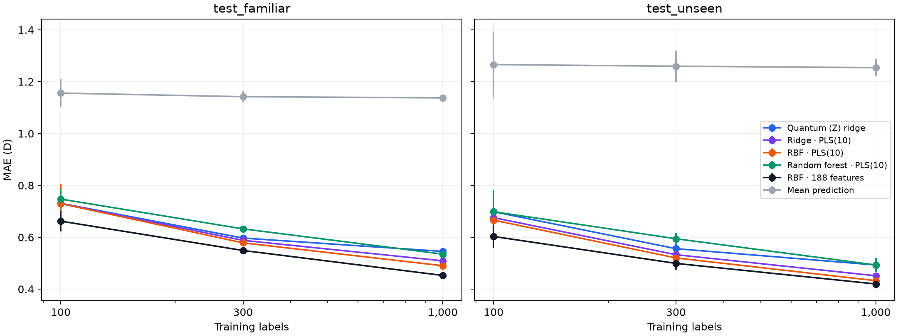

# Learning QM9 dipole moments from fewer labels: quantum-feature ⟨Z⟩ ridge

Qiskit Fall Fest 2026 (University of Ottawa) · Prompt 07/08, QML (Advanced)

We predict **dipole-moment magnitude |μ| in debye (D)** from atomic numbers and 3D geometry.
The presented quantum model is **quantum-feature ⟨Z⟩ ridge**: a fixed Qiskit circuit produces
one expectation per qubit, and a classical ridge readout predicts the target.

**Start here:** [07_quantum_feature_ridge.ipynb](notebooks/07_quantum_feature_ridge.ipynb)
shows this model's saved learning curves, matched classical comparisons, finite shots and IBM hardware results.
Implementation: [QuantumRidgeRegressor](src/qm9dipole/models/quantum.py),
training pipeline: [quantum_readout.py](src/qm9dipole/models/quantum_readout.py),
API documentation: [QUANTUM_FEATURE_MODEL.md](docs/QUANTUM_FEATURE_MODEL.md).

**Findings from the original run-1 results:**

- At 1,000 labels, ⟨Z⟩ ridge reaches **0.545 ± 0.011 D** MAE on `test_familiar` and
  **0.493 ± 0.021 D** on `test_unseen` (three seeds).
- Plain ridge on the same 10 inputs reaches **0.509 / 0.452 D**; RBF kernel ridge reaches
  **0.490 / 0.433 D**. These results do not show a quantum label-efficiency advantage.
- At 1,000 shots on the smaller quantum test subsets, MAE changes from **0.625 / 0.749 D**
  to **0.640 / 0.770 D** at N = 1,000.
- The model ran on IBM `ibm_quebec`: **160 circuits × 1,000 shots**, 45 s of charged QPU time.
  On 60 test molecules, device MAE was **0.778 D**, versus **0.794 D** in exact simulation.



The five other quantum models and their comparison notebooks are indexed in
[archive/quantum_models/](archive/quantum_models/README.md). Historical result files retain their original provenance;
the presentation notebook filters them to `qridge` and its classical baselines.

## Data and representation

**Source.** QM9 (Ramakrishnan et al. 2014): 133,885 molecules with up to nine heavy atoms (C, N, O, F). Geometries and
properties were computed with DFT at the B3LYP/6-31G(2df,p) level; they are reference calculations, not measurements.
The molecules come from the GDB-17 enumeration (Ruddigkeit et al. 2012).
- **Version:** figshare collection 978904 ("Quantum chemistry structures and properties of 134 kilo molecules"),
  downloaded 2026-10-04.
- **Getting the data:** it is not redistributed here. [notebooks/00_setup_and_data.ipynb](notebooks/00_setup_and_data.ipynb)
  downloads the three files (86 MB) into `data/raw/` and verifies them against figshare's published MD5 checksums. To
  download by hand, use the file IDs and checksums in [docs/DATA.md](docs/DATA.md).
- **Units:** μ in debye (D); coordinates in ångström (Å).

**Preprocessing** ([notebooks/01_parse_and_splits.ipynb](notebooks/01_parse_and_splits.ipynb), details in
[docs/DATA.md](docs/DATA.md)). The archive is read in place and parsed into one table with every field kept (0 parse
failures). 3,202 molecules are excluded, leaving **130,683**:

| Excluded | Count | Reason |
|---|---|---|
| Listed in QM9's `uncharacterized.txt` | 3,054 | The optimized geometry no longer matches the intended molecule |
| Flagged in QM9's readme as hard to converge | 8 | Saddle points or low convergence thresholds |
| Duplicate entries | 140 | Same molecule listed twice; keeps one copy, so no molecule can sit in two sets |

**Splits** ([src/qm9dipole/splits.py](src/qm9dipole/splits.py), [configs/splits.yaml](configs/splits.yaml), split seed
2026; saved as QM9 molecule IDs in [splits/](splits/)):

| Set | Molecules | Formulas | Role |
|---|---|---|---|
| Training pool | 99,198 | 497 | Training sets are drawn from it |
| `dev` (development, familiar formulas) | 5,000 | 257 | Model development, before any test run |
| `dev_unseen` (development, held-out formulas) | 4,183 | 26 | Development check on unseen formulas |
| **`test_familiar`** | 5,484 | 257 | Test: formulas present in training |
| **`test_unseen`** | 16,818 | 93 | Test: whole formulas absent from all training and development data |
| `test_familiar_q`, `test_unseen_q` | 80, 370 | 20, 93 | Small test subsets for the costly quantum shots/noise/hardware runs |

- **Nested training sets:** S_(s,N) for N = 100 ⊂ 300 ⊂ 1,000 ⊂ 3,000 ⊂ 10,000 ⊂ 30,000 ⊂ 99,198 and seeds
  s = 0, 1, 2, identical for every model, so comparisons are paired.
- **Anchors:** the 20 formulas of the familiar quantum subset are "anchored", so every training set contains them.
- **Checks:** every split invariant (disjointness, nesting, held-out formulas absent from training) is asserted when
  the splits are built and tested in [tests/test_splits.py](tests/test_splits.py), each test paired with a negative
  control.

**Inputs (features).** Every feature is a function of Z and R alone
([src/qm9dipole/descriptors.py](src/qm9dipole/descriptors.py), [features.py](src/qm9dipole/features.py),
[atoms.py](src/qm9dipole/atoms.py)). There are 188 molecule-level features:
- composition (5 element counts);
- engineered geometry, bond and ring features (26);
- functional groups (19);
- a charge-equilibration (QEq) dipole estimate (3);
- radial distribution functions (106);
- the sorted Coulomb-matrix eigenvalues (29).

The molecular features are invariant to rotation,
translation and atom reordering; tests check this, with a raw-coordinate negative control that must fail
([notebooks/02_descriptors_invariance.ipynb](notebooks/02_descriptors_invariance.ipynb)).

**Assumptions.**
1. The DFT-optimized geometry is an available input. In practice it costs a quantum-chemistry geometry optimization;
   the brief treats it as given.
2. |μ| is invariant to rotation, translation and atom relabeling, so the models must be too.
3. Every fitted transform (scaling, PLS, target transform, kernel bandwidths) is fit on the current training set only
   and refit for every (size, seed).
4. Labels are the QM9 reference values as published. Rare zwitterions with |μ| up to 29.6 D are kept: they are valid
   values, but they weigh heavily on RMSE.

## Quantum-feature ridge pipeline

Every learned transform is fitted inside each training/CV fold and refitted for each size and seed.

```text
Z, R → 188 molecular features → Yeo–Johnson scaling, clipped at ±10
     → PLS(10), standardized → angles γ·x
     → 10-qubit Qiskit ZZ feature map, linear entanglement, two passes
     → ten ⟨Z⟩ expectations → classical ridge readout
     → inverse target transform → dipole magnitude in debye
```

The encoding is built by `build_encoding_circuit` in [quantum.py](src/qm9dipole/models/quantum.py).
Exact evaluation uses the batched circuit simulator in [qsim.py](src/qm9dipole/models/qsim.py).
Finite shots estimate each expectation from ±1 outcomes; fake-backend noise and hardware use measured circuits.

**Output scaling and optimization.** The training target is `z = (sqrt(μ) − m) / s`, where
`m` and `s` are the training mean and standard deviation of square-root labels. The readout fits
`z_hat = b + Σ w_q ⟨Z_q⟩` by L2-regularized least squares. The final prediction is
`μ_hat = max(0, m + s·z_hat)²` in debye. Although each expectation lies in [−1, 1], the learned
weighted readout is unbounded. The standalone `QuantumRidgeRegressor` can also fit debye labels directly;
the reported comparisons use the transformed-target wrapper.

Five-fold training-only CV selects α and γ using pooled MAE in debye:
15 ridge penalties × 11 angle scales = **165 candidates**. Circuit weights are fixed; the trained weights
belong to the classical readout. The grid and preprocessing are retained from the original evaluation.

**Classical comparisons.** Mean prediction, plain ridge, RBF kernel ridge and random forest use identical saved
training subsets and evaluation splits. The compressed variants receive the same 10 PLS inputs;
classical models on all 188 features measure the effect of compression. The tuning budgets differ by model:
plain ridge has 15 candidates, RBF kernel ridge has 88, and random forest has 9. This is not an equal-budget comparison.

## Results

Saved run-1 test results; mean ± sample standard deviation over seeds 0, 1, 2. No models were retrained
or settings selected as part of archiving. Complete per-seed MAE and RMSE tables are displayed by the
[presentation notebook](notebooks/07_quantum_feature_ridge.ipynb).

| Model and inputs | N = 100, familiar MAE | N = 300, familiar MAE | N = 1,000, familiar MAE | N = 1,000, unseen MAE |
|---|---|---|---|---|
| **⟨Z⟩ ridge, PLS(10)** | 0.731 ± 0.072 | 0.597 ± 0.010 | **0.545 ± 0.011** | **0.493 ± 0.021** |
| Plain ridge, PLS(10) | 0.730 ± 0.061 | 0.588 ± 0.016 | 0.509 ± 0.009 | 0.452 ± 0.004 |
| RBF kernel ridge, PLS(10) | 0.730 ± 0.075 | 0.578 ± 0.010 | 0.490 ± 0.009 | 0.433 ± 0.010 |
| Random forest, PLS(10) | 0.747 ± 0.036 | 0.632 ± 0.003 | 0.535 ± 0.013 | 0.493 ± 0.027 |
| RBF kernel ridge, 188 features | 0.662 ± 0.040 | 0.549 ± 0.012 | 0.453 ± 0.009 | 0.420 ± 0.015 |
| Mean prediction | 1.156 ± 0.053 | 1.142 ± 0.022 | 1.138 ± 0.011 | 1.254 ± 0.032 |

For ⟨Z⟩ ridge at N = 1,000, RMSE is **0.781 ± 0.020 D** on `test_familiar` and
**0.748 ± 0.013 D** on `test_unseen`.

**Representation ablation: composition only versus geometry-aware inputs.** RBF kernel ridge uses
the same saved training subsets, evaluation splits and training-only CV procedure for both representations.
At N = 1,000, mean test MAE over seeds 0, 1, 2 is:

| Inputs | Familiar MAE (D) | Unseen MAE (D) |
|---|---|---|
| Composition only (5 element counts) | 0.942 | 0.807 |
| Geometry-aware, PLS(10) | 0.490 | 0.433 |

Geometry-aware inputs reduce MAE by **0.452 D** on familiar formulas and **0.374 D** on unseen formulas.
This is the classical RBF representation ablation; the saved ⟨Z⟩ ridge results use PLS(10) only.
Results at N = 100, 300 and 1,000 across three seeds are in
[test_run01_quantum.csv](results/comparison/test_run01_quantum.csv), under `model == "rbf_krr"`
and `inputs == "composition"` or `"pls10"`.

**Split interpretation.** `test_familiar` formulas occur in the training pool; only the 20 anchored
`test_familiar_q` formulas are guaranteed to occur in every small training subset. The full-set familiar
learning curve therefore does not guarantee formula familiarity at each N.

**Finite shots:** N = 1,000; the same 80 familiar and 370 unseen test molecules. Mean MAE in D;
these subsets have a different distribution from the full test sets.

| Regime | Exact | 100 shots | 1,000 shots | 10,000 shots |
|---|---|---|---|---|
| `test_familiar_q` | 0.625 | 0.779 | 0.640 | 0.624 |
| `test_unseen_q` | 0.749 | 0.869 | 0.770 | 0.749 |

At 1,000 shots the additional MAE is **0.015 / 0.021 D**. This adds prediction error at the same
label count; the exact comparisons already provide no evidence of a quantum label-efficiency advantage.

**Noise and hardware:** S_(0,100), 60 test molecules (30 per quantum subset), 1,000 shots.

| Exact | Ideal shots | FakeFez noise | FakeQuebec noise | IBM `ibm_quebec` |
|---|---|---|---|---|
| 0.794 D | 0.816 D | 0.812 D | 0.798 D | **0.778 D** |

With 60 molecules the MAE uncertainty is about ±0.1 D; the hardware result is consistent with simulation.
Job `db3da0kvf2bc73csuk60`, raw outcomes, molecule IDs and the circuit plan are in
[results/hardware/](results/hardware/).

**Cost.** The 10-qubit circuit transpiled for IBM Heron has depth 109 and 36 CZ gates.
Training at N = 1,000 requires 1,000 measured circuits; predicting the 22,302 full-test molecules requires
22,302 more. At 1,000 shots the estimated total is approximately **1.7 QPU hours**, excluding job and queue overhead.
The actual N = 100 hardware demonstration used 160 circuits and 45 s of charged QPU time.

## Setup and reproduction

Use Python **3.12**; exact package versions are in [requirements.txt](requirements.txt).

```bash
python3.12 -m venv .venv
source .venv/bin/activate
pip install -r requirements.txt
```

Data and features, in order:

```bash
jupyter nbconvert --to notebook --execute --inplace notebooks/00_setup_and_data.ipynb
jupyter nbconvert --to notebook --execute --inplace notebooks/01_parse_and_splits.ipynb
jupyter nbconvert --to notebook --execute --inplace notebooks/explore_02_cleaning_and_features.ipynb
```

The preprocessing choices are already committed in `results/development/explore03_preprocessing.json`.
The active [configuration](configs/test_eval.yaml) evaluates ⟨Z⟩ ridge and its classical baselines at
N = 100, 300, 1,000 with three seeds, plus shots and noise for ⟨Z⟩ ridge.

```bash
python scripts/final_eval.py --dry-run --smoke --sections quantum
python scripts/final_eval.py --config configs/test_eval.yaml --allow-dirty
jupyter nbconvert --to notebook --execute --inplace notebooks/07_quantum_feature_ridge.ipynb
```

The test evaluation writes a new run and logs its configuration; it does not overwrite run 1.
`--allow-dirty` permits the changes made by executing notebooks. The presentation notebook reads saved run-1
results and requires no QM9 download or model fit.

```bash
python scripts/hardware_run.py --backend ibm_quebec  # prints a plan
```

Hardware defaults to `qridge`. Submission and retrieval options are documented in that script;
the saved IBM account is required for a device run.

## Limitations and remaining documentation work

- Labels are DFT reference values, and the geometries are assumed available inputs.
- The 100-molecule descriptor checks cover composition and Coulomb spectra; the saved end-to-end
  quantum invariance table belongs to the archived fidelity model. An end-to-end ⟨Z⟩ ridge demonstration
  should be added before presenting that table as evidence for this model.
- The representation ablation above uses classical RBF kernel ridge. A corresponding ⟨Z⟩ ridge
  ablation and an assessment of representation cost remain to be added.
- The IBM run is one model, one seed, 60 test molecules and one calibration day.

## Data, methods and repository

QM9: Ramakrishnan et al., *Scientific Data* 1, 140022 (2014); GDB-17: Ruddigkeit et al.,
*Journal of Chemical Information and Modeling* 52, 2864 (2012). The circuit uses Qiskit's ZZ feature map;
preprocessing and readout use scikit-learn. Hardware access was provided through PINQ² for the hackathon.
Detailed history and references remain in the [previous writeup](archive/quantum_models/README_previous.md)
and [decision log](docs/DECISIONS.md).

```text
src/qm9dipole/models/quantum.py          active circuit and ⟨Z⟩ ridge estimator
src/qm9dipole/models/quantum_readout.py  active training pipeline and closed-form check
notebooks/07_quantum_feature_ridge.ipynb presentation from saved results
configs/test_eval.yaml                 active ⟨Z⟩ ridge + classical evaluation
archive/quantum_models/                broader comparison notebooks, configs, drivers and tests
src/qm9dipole/archive/quantum_kernel.py five archived quantum models
results/, figures/                    original outputs and presentation figure
splits/, docs/, tests/                 data IDs, protocol and checks
```
