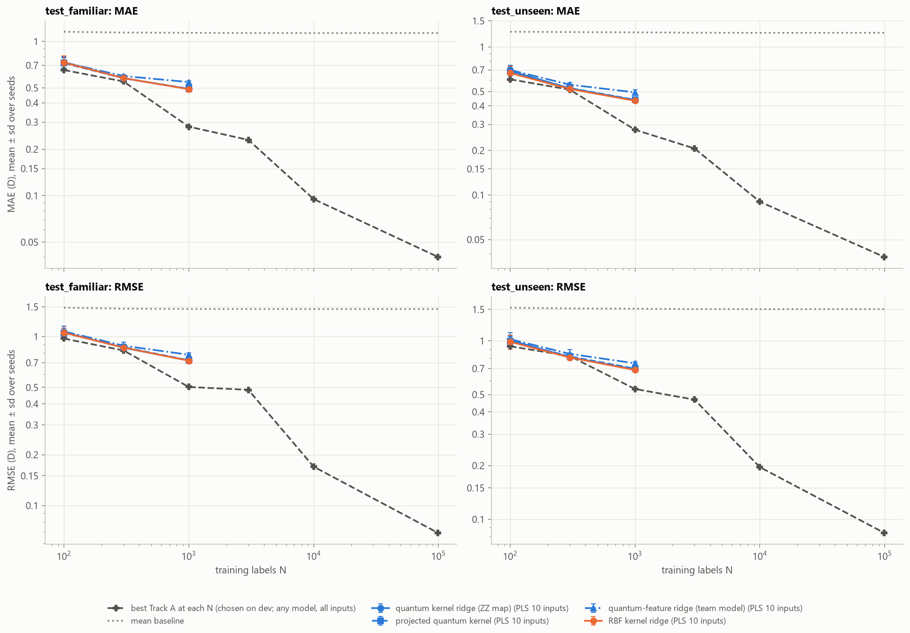
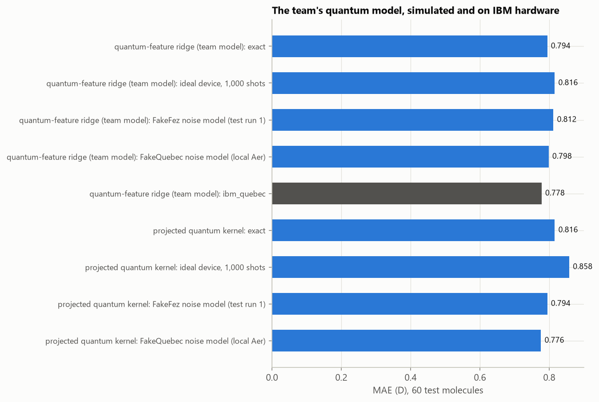

# QM9 dipoles from fewer labels

Qiskit Fall Fest 2026 (University of Ottawa), hackathon prompt 07 (QML, advanced).

We predict the **dipole-moment magnitude |μ| (debye)** of small organic molecules from QM9 with
a team-built **quantum kernel ridge regressor**. We compare it fairly against classical models as
the number of training labels grows, on molecules whose formulas were seen in training
(*familiar*) and on formulas never seen (*unseen*). Beating classical ML is not the goal; a fair
comparison and an honest conclusion are.

## How we work

**The headline comparison is strict.** It uses only atom types and 3D coordinates, as the brief
asks:
- every model sees the same nested training sets (100 ⊂ 300 ⊂ 1,000 ⊂ … ⊂ 99,198 molecules, 3 seeds; the
  quantum-comparable sizes are 100, 300 and 1,000);
- settings are tuned by cross-validation inside the training set only;
- the test sets are scored only by `scripts/final_eval.py`; every test run is logged (`results/test_runs.csv`),
  and the writeup states how many runs there were and what changed between them;
- every representation is tested for invariance to rotation, translation and atom reordering.

**Around it, we explore freely.** QM9 also records each atom's partial charge and 14 other
computed properties. A dipole is roughly a charge-weighted sum of atom positions, so the
charges alone already track |μ| closely. We use these extras to ask questions such as "how much
of the dipole do the charges explain?" and "does predicting charges first help a quantum
model?". Results that use them are labeled and reported separately, because those properties
come from the same quantum-chemistry calculation as the answer. Decisions, experiments and
dead ends are logged in `docs/DECISIONS.md`.

## Status

| Milestone | | Notebook |
|---|---|---|
| M0 Environment and QM9 download | done | `notebooks/00_setup_and_data.ipynb` |
| M1 Parser, exclusions, splits | done | `notebooks/01_parse_and_splits.ipynb` |
| M2 Descriptors and invariance tests | done | `notebooks/02_descriptors_invariance.ipynb` |
| X1 Classical statistical analysis (exploration), following PLAN.md literally | done, superseded by X2 | |
| X2 Classical rebuild for accuracy: Track A (best model from Z and R, up to 99,198 labels) and Track B (quantum-comparable, N ≤ 1000) | done | `notebooks/explore_01` … `explore_05` |
| M3 Classical baselines with CV and development-set scores | done (X2 Track B) | `notebooks/explore_04_classical_models.ipynb` |
| M4 Quantum kernel ridge regression (exact simulation) | done | `notebooks/explore_06_quantum_vs_classical.ipynb` |
| M5 Finite-shot and noisy inference (simulators) | done | `notebooks/explore_07_shots_noise_cost.ipynb` |
| M6 Representation ablation, quantum cost | done | `explore_04` (composition only), `explore_06`, `explore_07` (cost) |
| M7 Evaluation on the test sets, writeup | done (4 test runs) | `scripts/final_eval.py`, `configs/test_eval.yaml`, `notebooks/07_test_comparison.ipynb` |
| M8 Optional: projected quantum kernel, IBM hardware run | done: projected kernel; ⟨Z⟩ ridge on `ibm_quebec` (0.778 D, 45 s QPU) | `scripts/hardware_run.py`, notebook 07 section 9 |

Development-set results (before any test run): `docs/OVERNIGHT_REPORT.md`.

## Results on the test sets

All numbers: test-set MAE in debye, mean over 3 seeds, from `scripts/final_eval.py` (details, RMSE, standard
deviations and figures in `notebooks/07_test_comparison.ipynb`). Inputs: atomic numbers and 3D coordinates only.
Quantum models are simulated on this computer unless marked "IBM hardware". Guessing the average dipole gives
1.14 D (familiar formulas) and 1.25 D (unseen formulas).



**Quantum vs classical at the quantum-comparable sizes** (10 PLS inputs = 10 qubits; test run 1):

| Model | N = 100 | N = 300 | N = 1000 | N = 1000, unseen formulas |
|---|---|---|---|---|
| Quantum kernel ridge (ZZ map, 10 qubits; headline, chosen by CV) | 0.735 | 0.578 | 0.492 | 0.437 |
| Projected quantum kernel | 0.724 | 0.578 | 0.493 | 0.440 |
| Team's quantum-feature ⟨Z⟩ ridge | 0.731 | 0.597 | 0.545 | 0.493 |
| Product-state kernel (no entanglement; control) | 0.732 | 0.578 | 0.490 | 0.433 |
| RBF kernel ridge, same 10 inputs (matched classical twin) | 0.730 | 0.578 | 0.490 | 0.433 |
| Best quantum-comparable classical (CV): RBF kernel ridge, 188 features | 0.662 | 0.549 | 0.453 | 0.420 |
| Composition only (any model) | ≈ 0.99 | ≈ 0.98 | ≈ 0.94 | ≈ 0.81 |

**The most accurate classical model** (Track A; latent-charge network from N = 1000, chosen on the development set):

| N | 100 | 300 | 1,000 | 3,000 | 10,000 | 99,198 (all, 1 seed) |
|---|---|---|---|---|---|---|
| familiar formulas | 0.653 | 0.550 | 0.280 | 0.230 | 0.095 | **0.040** |
| unseen formulas | 0.604 | 0.514 | 0.276 | 0.206 | 0.090 | **0.038** |

**On a quantum device.** A device estimates every quantum number from a finite number of measurements
("shots"). Tuned on exact kernels, the fidelity-kernel model collapses at N = 1000 (≈ 10 D at 1,000 shots per
circuit, run 1): cross-validation picks a setting whose kernel differences are smaller than the shot noise. Tuned
with the shot noise inside cross-validation (run 2, post-hoc), it scores **0.544 / 0.497 D** at 1,000 shots and
0.513 / 0.464 D at 10,000 (familiar / unseen, N = 1000). The feature-based quantum models (projected kernel, the
team's ⟨Z⟩ ridge) tolerate shots and simulated hardware noise (FakeFez and FakeQuebec noise models, within ≈ 0.04 D
of exact). The ⟨Z⟩ ridge also ran on **IBM's `ibm_quebec`** (160 circuits × 1,000 shots, 45 s of QPU time, job
`db3da0kvf2bc73csuk60`): trained and evaluated on the device's measurements of 100 training and 60 test molecules, it
scores **0.778 D**, against 0.794 D in exact simulation and 0.798 D on the device's noise model, the same within
sampling error (notebook 07, section 9).


Cost decides what can run at all: predicting the 22,302 test molecules at N = 1000 needs ≈ 23 million circuits for
the fidelity-kernel model (one per pair of molecules), against ≈ 70,000 for the projected kernel and ≈ 23,000 for the
⟨Z⟩ ridge.

**Conclusion.** With 10 inputs (10 qubits), the quantum kernels behave like a classical RBF kernel: they match their
classical twin to within 0.005 D, a no-entanglement control does just as well, and no quantum model beats the best
classical model at any training size. The classical models keep improving with more labels (0.040 D with all 99,198),
which the quantum models cannot reach within any realistic QPU budget. On a device, only the shot-aware or
feature-based quantum models are usable; the latter fit a QPU budget, and the team's ⟨Z⟩ ridge ran on
IBM hardware (`ibm_quebec`) with no loss of accuracy.

**How the test sets were used.** Four test runs (`results/test_runs.csv`). Run 1 used the development settings,
unchanged. Run 2 was designed **after** seeing run 1 (shot-aware quantum kernels) and is labeled post-hoc; it
leaves every run-1 model unchanged and reproduces the 180 rows it shares with run 1 exactly. Run 3 rehearsed the
hardware run on ibm_quebec's noise model; run 4 is the IBM hardware run. In every run, all settings were tuned by cross-validation inside the
training sets; no test set chose a setting within a run. The development notebooks (`explore_01`–`07`) never read a
test set.

**Caveats.** QM9's labels and geometries are DFT calculations, not experiments; the models take the DFT-optimized
geometry as input, which itself costs a quantum-chemistry calculation (the brief's "assumed available input"). Track A's
full-pool result uses one seed (cost). Exclusions and split construction: `docs/DATA.md`.

## Setup

You need Git and either conda or Python 3.12. Every command below runs from the repository
root.

**Option A: conda**

```bash
conda env create -f environment.yml
conda activate qm9dipole
pip install -r requirements.txt
```

**Option B: plain Python.** This needs Python **3.12** installed. Create the venv with 3.12
*explicitly*, because a bare `python` may point to a different version:

```bash
py -3.12 -m venv .venv            # Windows (Python launcher)
python3.12 -m venv .venv          # macOS / Linux

.venv\Scripts\activate            # Windows: PowerShell or cmd
source .venv/Scripts/activate     # Windows: Git Bash
source .venv/bin/activate         # macOS / Linux

python --version                  # must print Python 3.12.x
pip install -r requirements.txt
```

If `python --version` shows another version, delete `.venv` and recreate it with a 3.12
interpreter.

Both options install the exact package versions in `requirements.txt`, plus this project's
`qm9dipole` package in editable mode. The notebooks import it. With conda, run `pip install`
*after* `conda activate`: activation hides any packages in your per-user Python folder, which
would otherwise make pip skip dependencies (see the comment in `environment.yml`).

**Troubleshooting**
- `No matching distribution found for numpy==2.5.3`: the environment is not Python 3.12. The
  pinned numpy needs 3.12, so recreate the venv as above.
- Windows, `OSError: [Errno 2] No such file or directory` with a very long path during
  `pip install`: the path exceeds Windows' 260-character limit. Clone into a shorter folder,
  or enable long paths (*Local Group Policy → Enable Win32 long paths*, or the registry value
  `LongPathsEnabled`).
- The first notebook cell says the package "belongs to the checkout at …": the selected kernel
  is an environment set up for a different copy of the project. Select this copy's environment.

**Choosing the notebook kernel.** The notebooks use the standard `python3` kernel, which means
"the Python of the environment Jupyter runs in":
- **JupyterLab:** with the environment activated, run `jupyter lab` and keep the default kernel.
- **VS Code:** open a notebook, click the kernel picker, choose *Python Environments*, then pick
  `qm9dipole` (conda) or `.venv`.

The first cell of every notebook checks the environment. It stops with instructions if the
package is missing, and warns if installed versions differ from `requirements.txt`.

**Check the install:** `pip check` should report no broken requirements, and `pytest -q`
should report all tests passing.

## Reproduce

Run the notebooks in order. Each runs top to bottom and is safe to re-run.

| Notebook | What it does | Time |
|---|---|---|
| `00_setup_and_data.ipynb` | Downloads QM9 (86 MB) into `data/raw/` and verifies it against the published checksums | ~1 min |
| `01_parse_and_splits.ipynb` | Parses all 133,885 molecules into `data/processed/qm9.parquet`, applies exclusions, rebuilds `splits/` | ~1 min |
| `02_descriptors_invariance.ipynb` | Builds the descriptors, checks invariance to rotation, translation and atom reordering (with a negative control), writes `results/m2_descriptor_invariance.csv` | ~10 s |

Splits are deterministic. Rebuilding them reproduces the committed `splits/*.json` molecule IDs
exactly. Only the `git_hash` stamp changes.

**The exploration chain (X2)** is a sequence: each notebook reads the previous one's output
(`src/qm9dipole/explore.py`), so run them in order. Thresholds live in `configs/explore.yaml`. It uses the training
pool, the training sets and the two development sets (`dev`, familiar formulas; `dev_unseen`, formulas absent from
training) only; no test set. Long notebooks cache finished fits per commit in `data/processed/cache/`, so an
interrupted run resumes.

| Notebook | What it does | Time |
|---|---|---|
| `explore_01_eda.ipynb` | Exploratory data analysis of every QM9 field: roles (headline-legal vs DFT output), integrity, duplicates, distributions, information about \|μ\|, redundancy, outliers; writes recommendations | ~30 s |
| `explore_02_cleaning_and_features.ipynb` | Cleaning; molecule-level features (bond dipoles, QEq charge-equilibration dipole, charged groups, radial distributions) and 85 per-atom environment features; feature catalog | ~2 min |
| `explore_03_standardization_and_dimension.ipynb` | Chooses feature scaling and target transform per track; the Track B reduction (PLS, k = 10); feature ranking; effective dimension | ~1.5 h |
| `explore_04_classical_models.ipynb` | Track A learning curves to the full pool (ridge, RBF kernel ridge, XGBoost, latent-charge network); Track B baselines at N ≤ 1000; effective number of parameters | ~9 h from scratch (~1.7 h with the Track A fits cached) |
| `explore_05_generalization_and_diagnostics.ipynb` | New formulas, error structure, permutation importance, what the charge network learned, end-to-end invariance | ~30 min |
| `explore_06_quantum_vs_classical.ipynb` | Quantum kernel ridge (three team encoders, a no-entanglement control), projected quantum kernel and the team's quantum-feature ridge against matched classical models, Track B and Track A; qubit count, inputs, kernel diagnostics, invariance | ~1.5 h (minutes when its fits are cached) |
| `explore_07_shots_noise_cost.ipynb` | Quantum cost on IBM Heron (transpiled locally), finite-shot inference, noisy simulation with a fake-backend noise model (local Aer only) | ~50 min |

To run everything without opening Jupyter:

```bash
jupyter nbconvert --to notebook --execute --inplace notebooks/00_setup_and_data.ipynb
jupyter nbconvert --to notebook --execute --inplace notebooks/01_parse_and_splits.ipynb
jupyter nbconvert --to notebook --execute --inplace notebooks/02_descriptors_invariance.ipynb
pytest -q
# the exploration chain, in order (long ones need no cell timeout):
for nb in explore_01_eda explore_02_cleaning_and_features explore_03_standardization_and_dimension \
          explore_04_classical_models explore_05_generalization_and_diagnostics \
          explore_06_quantum_vs_classical explore_07_shots_noise_cost; do
  jupyter nbconvert --to notebook --execute --inplace --ExecutePreprocessor.timeout=-1 notebooks/$nb.ipynb
done
```

The test-set evaluation (M7) is a script, so each test run is one logged unit. It retrains every model of
`configs/test_eval.yaml` with the development notebooks' code (tuning inside the training sets only), scores
the test and development sets, and adds finite-shot and noisy-simulator runs on the quantum test subsets
(simulators only). `notebooks/07_test_comparison.ipynb` presents the latest run.

```bash
python scripts/final_eval.py --dry-run --smoke   # minutes: development sets only, one seed, N = 100
python scripts/final_eval.py                     # a test run (~3-4 h); refuses uncommitted code
jupyter nbconvert --to notebook --execute --inplace notebooks/07_test_comparison.ipynb
```

The team may change models after a test run and run again (CLAUDE.md rule 2): edit the config or code, say what
changed in the config's `note`, commit, rerun. Each run's results are kept (`results/test_runNN_*.csv`).

### Running on IBM quantum hardware (optional)

`scripts/hardware_run.py` measures the quantum models' circuits on a device: the projected quantum kernel
(X, Y and Z bases) and the team's ⟨Z⟩ ridge end to end (100 training + 60 test molecules, readout refit on
the measured features), plus a 10 × 5 block of fidelity-kernel entries. The fidelity-kernel *model* is not run
on hardware: it needs one circuit per pair of molecules (~5,000 to train even at N = 100). Default plan:
700 circuits × 1,000 shots ≈ 3 min of QPU time on `ibm_quebec`; the job is capped at `--max-seconds`.

```bash
python scripts/hardware_run.py --dry-run                      # local Aer with ibm_quebec's noise model (FakeQuebec)
python scripts/hardware_run.py --backend ibm_quebec           # plan only: circuits, shots, QPU time; submits nothing
python scripts/hardware_run.py --backend ibm_quebec --submit  # one job; asks you to type 'submit' to confirm
python scripts/hardware_run.py --retrieve <job id>            # if the wait was interrupted
```

The IBM account is read from your local Qiskit config (`QiskitRuntimeService(name="pinq2")`, saved once with
`QiskitRuntimeService.save_account(...)`); never put a token in the repository.

## Quantum regression models (M4–M6)

`src/qm9dipole/models/quantum_kernel.py` holds the quantum models of the comparison, all built on the team's Qiskit
encoders (`build_encoding_circuit`, below) and simulated exactly on a CPU:
- **quantum kernel ridge (QKRR):** kernel ridge regression with the fidelity kernel k(x, x′) = |⟨ψ(x)|ψ(x′)⟩|²;
- **projected quantum kernel:** an RBF kernel on each qubit's reduced state (its Bloch vector), after Huang et
  al. (2021);
- the team's **quantum-feature ridge** (below), with a fast exact `simulation_method="batched"`.

`KernelRidgeFitter` tunes any kernel with exactly the protocol the classical models use (same folds, pooled CV MAE in
debye, same refit); with the RBF kernel it reproduces the classical harness (a unit test checks this), so a quantum vs
RBF difference comes from the kernel, not the tuning. Statevectors come from `models/qsim.py`, which evolves every
molecule through the same Qiskit circuit at once and matches `qiskit.quantum_info.Statevector` to 1e-12.
`noise.py` adds finite shots (validated against Aer's sampler) and fake-backend noise models (local Aer); `cost.py`
transpiles circuits for IBM Heron and counts circuits and QPU time. Nothing runs on IBM hardware.

## Quantum-feature regression prototype

`src/qm9dipole/models/quantum.py` implements a fixed Qiskit data encoder with a classical
linear ridge readout. `QuantumRidgeRegressor` fits `StandardScaler` on training inputs,
binds `gamma` times the standardized scores as circuit data, measures one local Z expectation
per qubit, and fits `Ridge` on debye labels. There are no variational gate weights.
The circuit needs fixed-width inputs; it does not make raw XYZ inputs invariant.

The legacy default remains one input column per qubit with `n_qubits=None`, `encoding="zz"`
and `simulation_method="statevector"`; 4–8 columns are a small starting example. The unchanged
readout/scaling defaults are `alpha=1.0`, `gamma=1.0`, `reps=2`, `batch_size=128` and
`clip_negative=True`. These are illustrative, not selected hyperparameters.

An explicit `n_qubits` is independent of input width. For example, 24 columns can use 8 qubits
without first requiring PCA:

```python
from qm9dipole.models.quantum import QuantumRidgeRegressor

# X_train and X_val have 24 fixed-width descriptor columns.
model = QuantumRidgeRegressor(
    n_qubits=8,
    encoding="ry_rz",
    simulation_method="matrix_product_state",
)
model.fit(X_train, y_train)          # y_train: dipole magnitude in debye
predictions = model.predict(X_val)  # debye; negative predictions clipped at 0
features = model.quantum_features(X_val)
assert features.shape == (len(X_val), 8)
encoder = model.pipeline_.named_steps["quantum"]
assert encoder.n_upload_layers_ == 2  # ceil(24 / (8 qubits * 2 angles))
```

Each encoding defines a constant ordered axis tuple with `A` input-angle slots per qubit per
upload. Capacity is `Q * A` for `Q` qubits. Zero-based input `i` maps to
`upload = i // (Q * A)`, `qubit = (i % (Q * A)) // A`, `rotation = i % A`.
Unused slots are zero-filled; `n_upload_layers_ = ceil(n_inputs / (Q * A))` counts uploads
per complete input pass, and `reps` repeats those complete passes.

- `encoding="zz"`: one phase input per qubit/upload (`A=1`), using the built-in Qiskit
  `zz_feature_map` with linear entanglement and `reps=1` blocks. The complete encoder needs
  `reps >= 2` to avoid constant Z readout, and at least two qubits.
- `encoding="ry"`: one RY input angle per qubit/upload (`A=1`).
- `encoding="ry_rz"`: ordered RY then RZ input angles (`A=2`). Both angle encoders use library
  gates, a fixed `RX(pi/4)` mixer after each upload to expose phase inputs to Z readout, and
  neighboring CZ gates between steps. They allow `reps >= 1` and at least one qubit.

`quantum_features(X)` returns dimensionless expectations with shape `(n_samples, Q)`, not
necessarily the input width. Changing the encoding/qubit count changes the model; this is not
a lossless reshaping of the inputs. The fitted ridge readout maps expectations to physical
units. This is a linear projected quantum-feature model, not the pairwise fidelity kernel.

Any tuning uses training-only CV and refits all learned transforms in each fold. Upstream PCA
is optional; if used, put it **before this model in the same sklearn `Pipeline`**, not in
globally fitted scores supplied to CV. There is no arbitrary division by 255: that scale is
appropriate only for known 8-bit pixel inputs, not generic molecular descriptors.

Both simulation options are local only: `statevector` uses `StatevectorEstimator`, while
`matrix_product_state` uses Aer exact expectations with truncation threshold zero. Neither
uses finite shots or a noise model here. Matrix product state (MPS) simulation can be efficient
for shallow nearest-neighbor structure, not arbitrary deep or highly entangled circuits.
No IBM services are connected; a hardware adapter remains separate work.

Run the synthetic smoke notebook, including the same 24-input arrays across all nine
combinations of 8/16/24 qubits and ZZ/RY/RY-RZ encoding with MPS:

```bash
jupyter nbconvert --to notebook --execute --inplace notebooks/02_quantum_regression.ipynb
pytest -q tests/test_quantum.py tests/test_quantum_encoding.py
```

The notebook reports a training-mean baseline, validation MAE/RMSE, dimensions, logical
circuit cost and local elapsed time without tuning or selecting a final model. It does not
access QM9 test sets or hardware, complete M4, or commit the final hardware architecture.
Nothing in this prototype demonstrates quantum advantage.

## Data

QM9: Ramakrishnan, Dral, Rupp, von Lilienfeld, *Scientific Data* 1, 140022 (2014), from GDB-17
(Ruddigkeit et al. 2012), <https://quantum-machine.org/datasets/>. The data is not redistributed
here: notebook 00 downloads it from figshare. `docs/DATA.md` documents the checksums, the 3,062
excluded molecules (with reasons), the working pool and the splits.

## Repository layout

```
notebooks/      one notebook per milestone (the entry points); explore_* for the exploration chain
src/qm9dipole/  all logic: data.py (download, parsing, exclusions), splits.py, descriptors.py,
                features.py, atoms.py, invariance.py, provenance.py; eda.py, cleaning.py, preprocess.py,
                complexity.py, evaluate.py, analysis.py, explore.py, plots.py, noise.py, cost.py, models/
                (classical.py, fitters.py, charge.py: latent-charge network; quantum.py: the team's encoders
                and quantum-feature ridge; qsim.py: batched statevectors; quantum_kernel.py: quantum kernels)
tests/          pytest suite, including negative controls for every split check and invariance test
results/        result tables (CSV), each with a .meta.json provenance file
configs/        splits.yaml (seeds and sizes; its hash is stamped into every split file),
                explore.yaml (exploration thresholds)
splits/         saved molecule-ID lists: test sets and nested training sets
docs/           BRIEF.md (requirements), PLAN.md (design), DATA.md, DECISIONS.md (change log)
figures/        generated figures
data/           raw download and parsed table (not committed)
```

`CLAUDE.md` holds the working rules for the AI coding assistant used on this project. Its
"Evaluation rules" and "Exploration" sections are also the most detailed statement of the
protocol summarized under "How we work".

## Hardware

Everything runs on simulators. Real IBM Quantum hardware is used only by explicit team decision,
with the circuits, shots and estimated QPU time stated beforehand.
